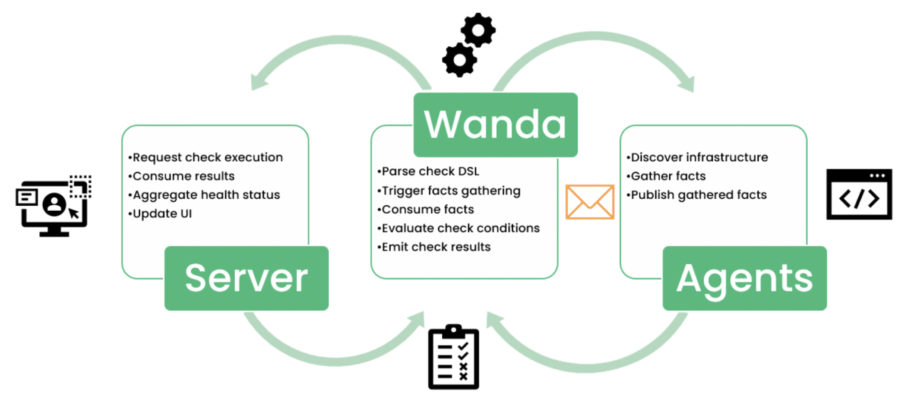

## How it Works

## Get Started with Trento
Use Trento with you SAP Application server and improve the overall visibility and discovery of faults which are aligned to the SUSE SAP Best Practice Guidelines.

Read Documentation