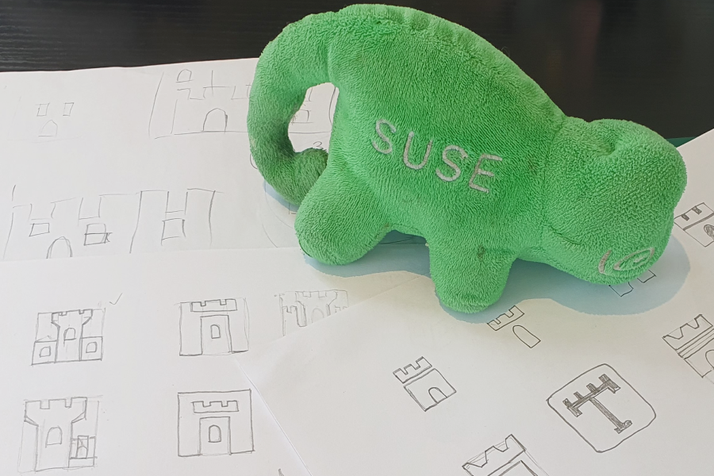
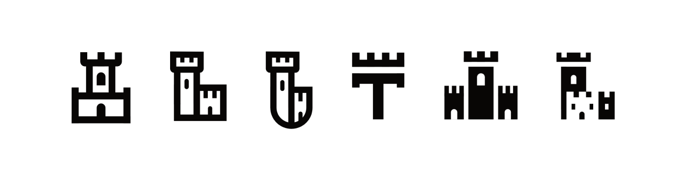
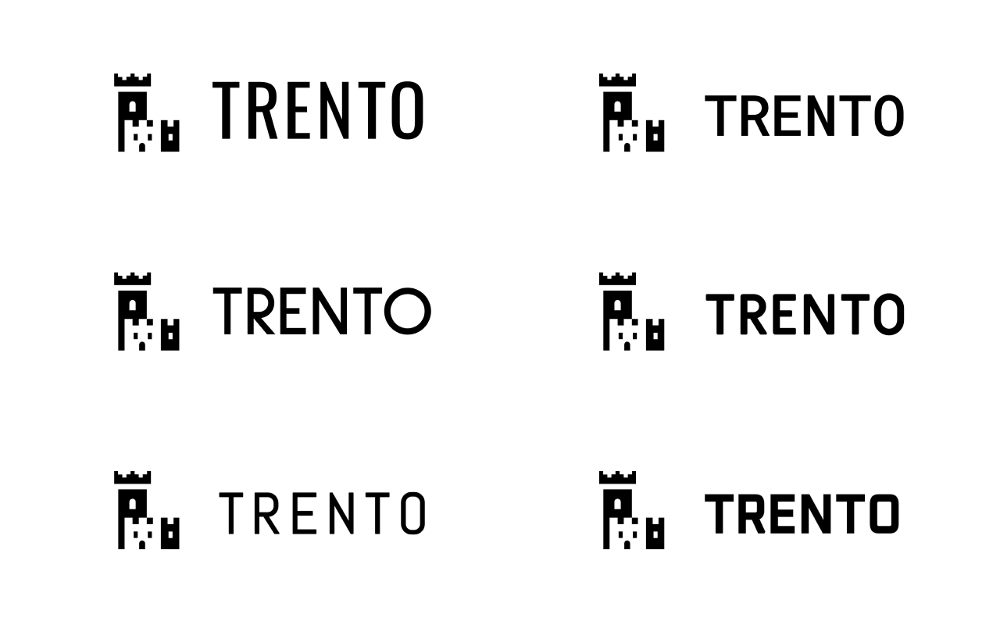
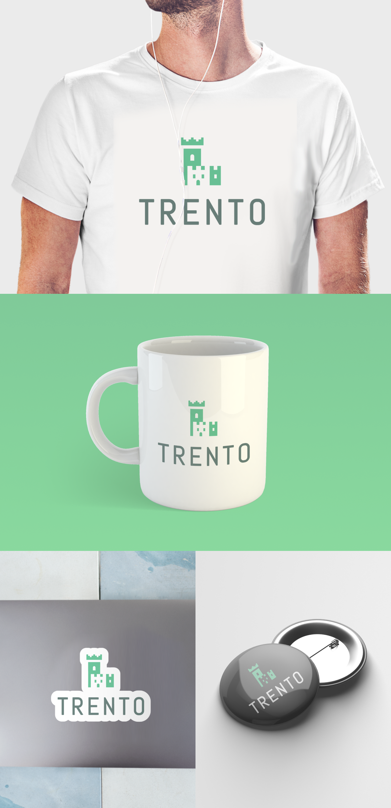

It has been just over 3 years (2 Feb 2021) since the humble beginnings of the Trento project. What started out as a little SUSE Hack Week project, has grown into a fully fledged companion application for our **"SUSE Linux Enterprise Server for SAP Application”** product, and a key differentiator in SUSE’s portfolio. Much like the initial project, there has been a series of developments that led the Trento project to progress from its infancy. By redesigning the logo we were wanting to also demonstrate that sense of growth.

Since the hiring of our product designer, it has been a shared goal between our designer and manager to redesign the Trento logo. For the logo redesign we wanted to stay true to the spirit of the Trento project. What is Trento? Well, besides being a cutting-edge, mission-critical workload monitoring platform, it also shares the name with a well known city in northern Italy. Trento, the city is renowned for its prosperity, being a center of educational, scientific, financial and political matters. It also has a strong renaissance and medieval architecture. It was this architectural influence that led us to discover one of the main landmarks: the Praetorian Palace and its characteristic bell tower, the Civic Tower. This tower, in particular, is the main inspiration for the redesign logo. Let's discover how this inspiration was explored in the design process.

After having done some initial background research about Trento and similar brand logo research it was time to put pencil to paper. We wanted the logo to be simple, iconic, professional and modern. The first step in the process was to sketch up logo ideas so that they would identify which shapes would work for the emblem. These sketches were used as a base to create vector shapes to form the logo.

Various techniques were used to create the logos using outlines and shapes. Other inspirations like pixel art and faux 3D perspectives were referenced. While creating a diverse range of options only a handful had potential. These options were then reviewed by the entire team so that we could decide on which direction would be best.

After the first team review it was beginning to feel clear which options were stronger. As mentioned before, the team wanted to retain its ‘castle’ symbol. This symbol was already well known by early users and within the greater organisation of SUSE. The logo options were then revised by beginning to introduce colours and various different fonts.

After reviewing the logo options with the fonts and colours, it was clear which one was the strongest logo. While there was some minor feedback from the team, it was easily implemented. The new logo now pays better homage to the Civic Tower, while at the same time reinforcing the brand identity that was established by the original. It is clear to see that, much like the project, the logo is more refined and established and is able to stand better on its own feet.

 and New (Right) Logo")

We hope that this new identity will help to communicate a sense of progression with the project and serve it well for future iterations of the product. Now that we have a new Trento logo, you can be sure to see it across more spaces than just the web. We are hoping to add this new and improved logo to t-shirts, stickers and more. Be sure to keep an eye out for this in the future.