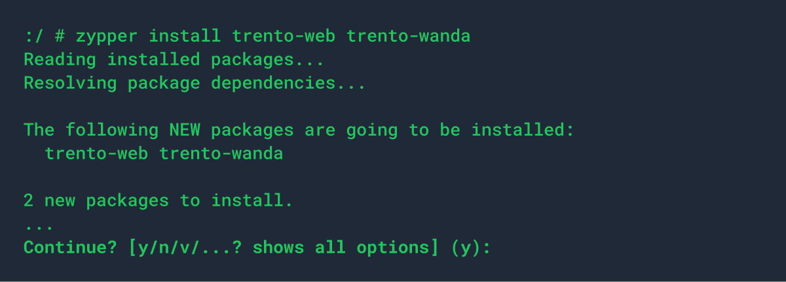
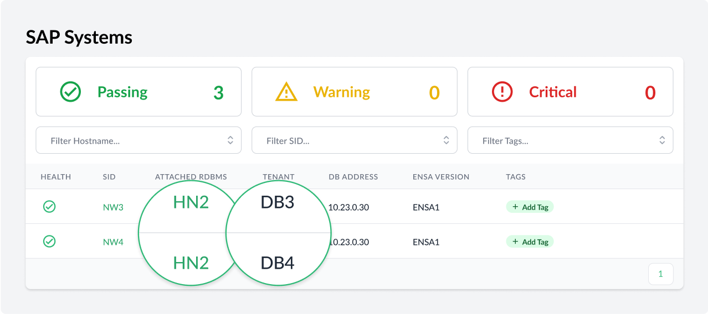
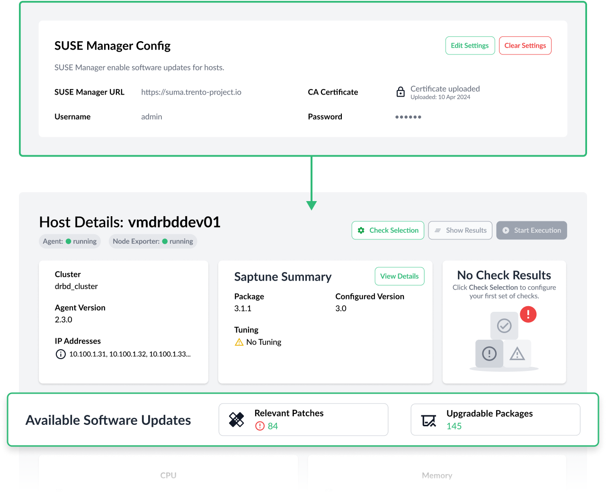
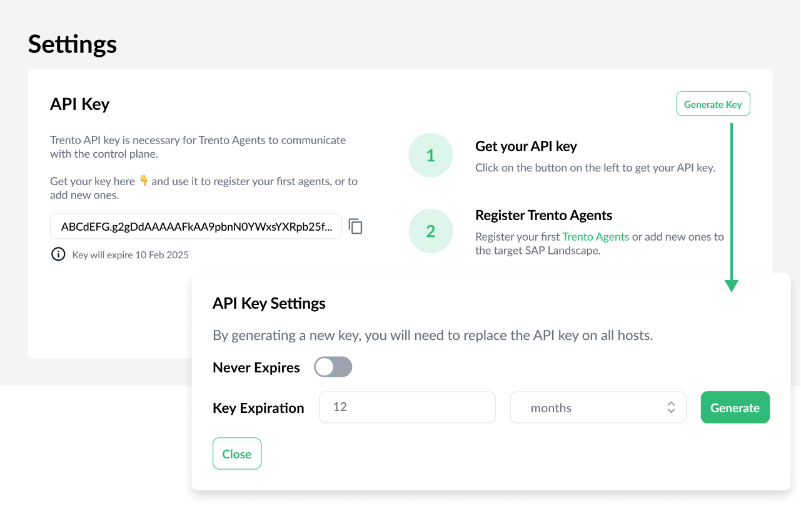
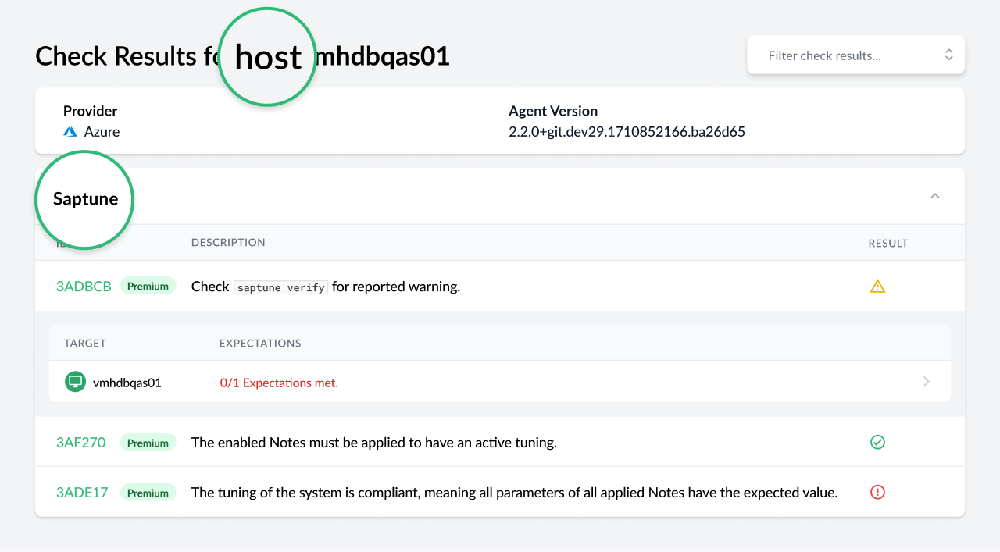
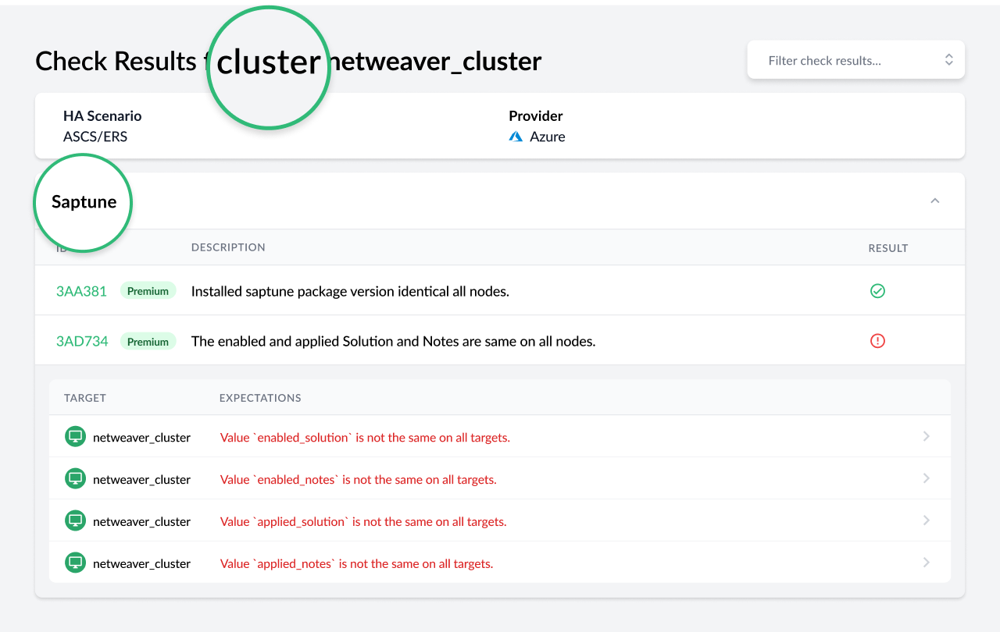
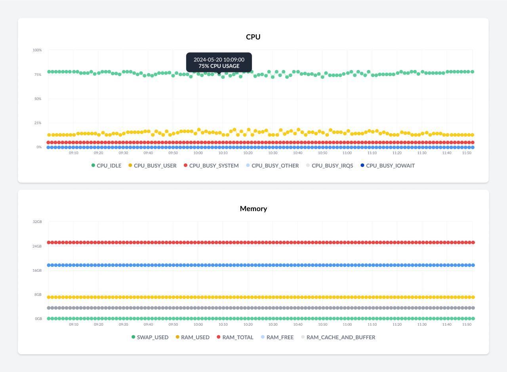
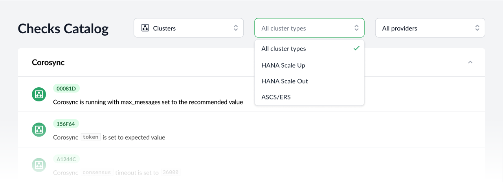

Trento 2.3 boasts an alternative, more traditional, installation process for Trento Server based on rpm packages, enhanced discovery capabilities and a simpler, safer architecture thanks to the removal of Grafana and the introduction of a rotating API key. Let's review these new features more in detail.

# Non-K8s Installation of Trento Server
Trento was born as a cloud-native application and, as such, the server was only available until now as a set of container images that could be pulled from the SUSE registry and deployed on any certified Kubernetes distribution.

But time has shown us that the usage of Kubernetes technology is a challenge for many SAP customers. Sometimes because they don’t have exposure to the technology, sometimes because it forces them to rely on other areas of their IT organizations.

Regardless the reason, we have decided to provide a alternative installation process for Trento Server based on rpm packages, which will be available in the repositories of [SLES for SAP 15 SP3](https://www.suse.com/products/sles-for-sap/) and higher. Customers will have a choice of performing the installation manually step-by-step or automating it using an Ansible playbook.

When a customer chooses to deploy Trento Server using rpms, the different components will be available as regular systemd services.

# Enhanced Discovery Capabilities
Monitoring is one of the cornerstones of Trento and Trento 2.3 comes with significant enhancements on this regard. Particularly, in terms of discovery.

For starters we have improved the support for HANA multi-tenant scenarios. A few customers had reported discovery issues when different systems were using the same HANA database. These issues were caused by a restrictive internal representation of the systems in the Trento database. So we have revisited this representation to ensure that those discovery issues don’t happen any more.

Trento 2.3 is able to discover HANA scale-out clusters, in addition to the HANA scale-up and ASCS/ERS clusters supported until now. The discovery includes nodes not running HANA workloads, for example a majority maker, and it provides information about the roles of the nameserver and indexserver services in each relevant node.

This new version is able to discover clusters using diskless SBD fencing and the discovery is aware of maintenance situations. It can detect a maintenance status at three different levels: the cluster itself, one particular node or one particular resource in one node.

# Integration with SUSE Manager
The integration of Trento and [SUSE Manager (SUMA)](https://www.suse.com/products/suse-manager/) is strategic for SUSE as we believe that SAP customers can greatly benefit from both applications working together. Trento brings the intelligence about the SAP environment while SUMA provides operational capabilities to maintain the OS up to date.

This version of Trento brings a first iteration in this integration effort. By entering the connection data for a SUMA instance where the Trento hosts are also registered, the SAP admin will be able to know how many software updates are available for those hosts and, more importantly, if any of them are security related and therefore critical.

Just a first step in a road that will get us to a point where the SAP administrator is able to orchestrate the patching of the operating system of their SAP environments via Trento with SUMA in the background. We will approach this goal progressively, starting with the application of individual patches on a given host, continuing with the patching of the nodes of a cluster, then the patching of all the hosts that part of one SAP system and wrapping it up with the orchestration of the patching of an entire landscape: first development, then quality assurance, finally production, or whatever roles the customer might have defined in their environment.

# Rotating API Key
In SUSE in general, and in the Trento team in particular, we strive to make our applications as secure as possible. This is another step in that direction. The API key protects the communication from the agent to the server. By allowing the customer to change it and even set an expiration date on it, we further protect this communication from modification, theft and other forms of compromise.

# Saptune Configuration Checks
The previous version of Trento brought the integration of [saptune](https://github.com/SUSE/saptune) into the console, giving SAP administrators visibility on the tool even when they are not working at operating system level. Version 2.3.1 of Trento reinforces such integration by introducing saptune related configuration checks, which has been possible thanks to significant improvements in the Checks development environment. Now we can execute checks not only against clusters but also individual hosts and they can behave in a non-boolean fashion, understanding expectations which evaluations can return a range of results rather than a simple true or false. On this regard, there are two types of saptune checks: those that have a host as a target, and those that have a cluster as a target.

# More Enhancements
Another step towards simplifying the architecture and strengthening the overall security set up has been the removal of Grafana, which was used to render graphical charts of the metrics collected by prometheus in the dashboard. Now we are using an ad-hoc library called Charts.js which delivers a visualization of the charts better aligned with the rest of the console.

And last but not least, as mentioned above we have introduced significant changes in the checks development environment which will allow us to extend the checks catalog, not just to other scenarios, but also to other targets in the environment such a hosts, HANA databases and SAP systems. The saptune checks are a first step in this process, making it necessary the introduction of additional filtering capabilities in the Checks Catalog view of the console.

# Are you wanting to upgrade or try out Trento?
Follow the [instructions in our documentation](https://documentation.suse.com/sles-sap/trento/single-html/SLES-SAP-trento/index.html "Getting started with Trento Premium") to get started.
