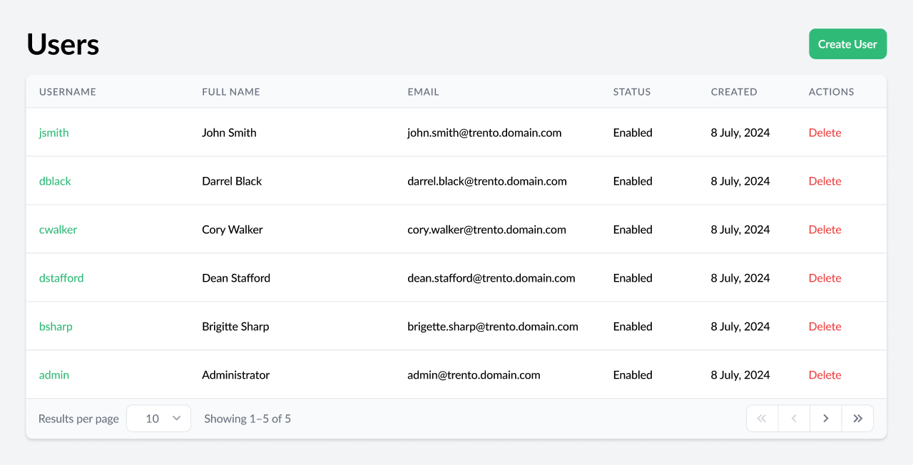
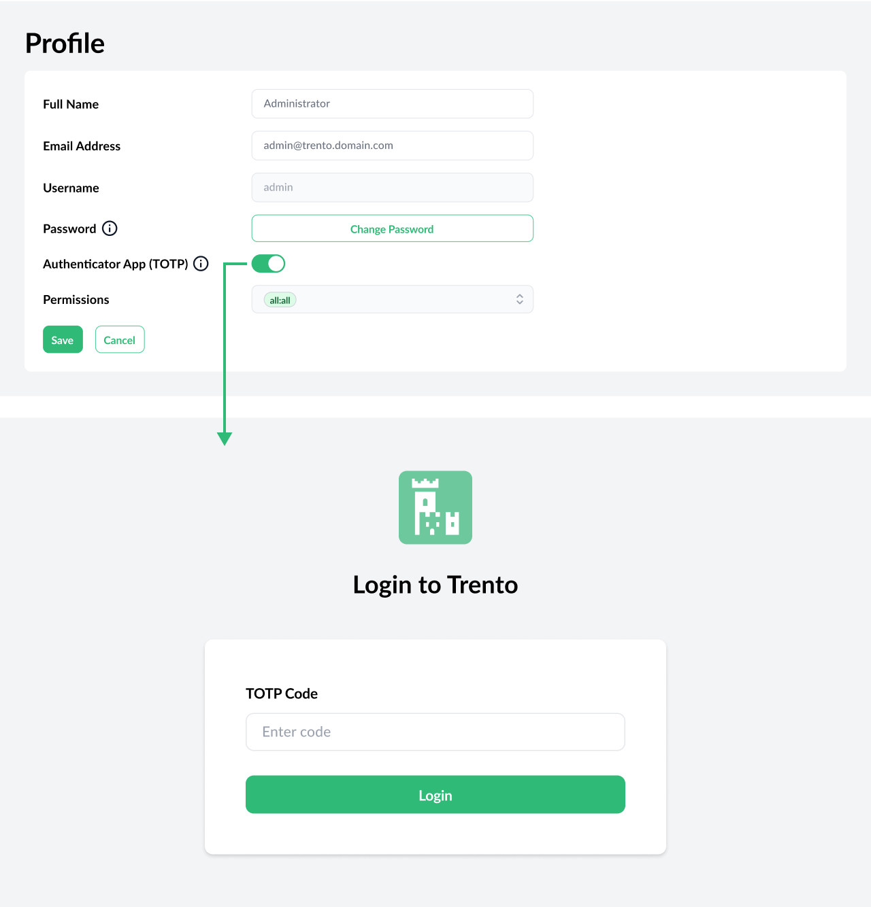
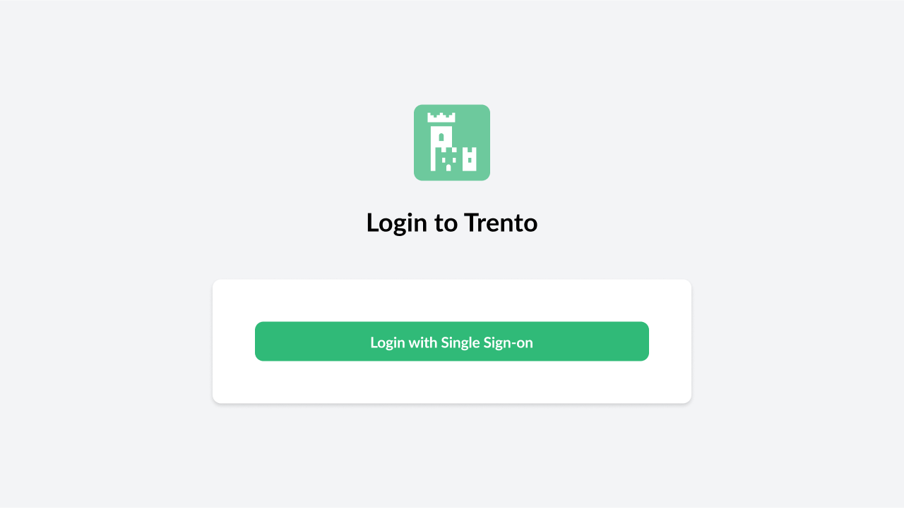
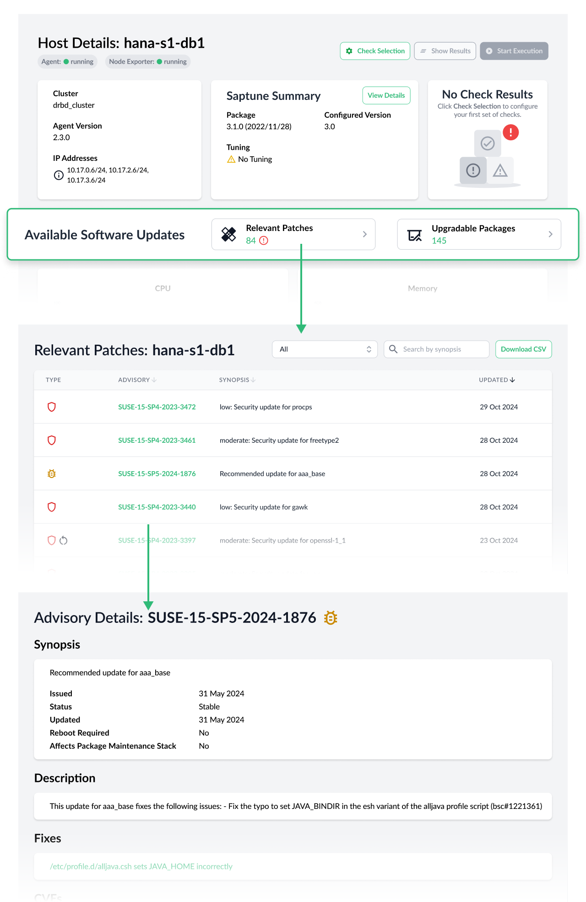
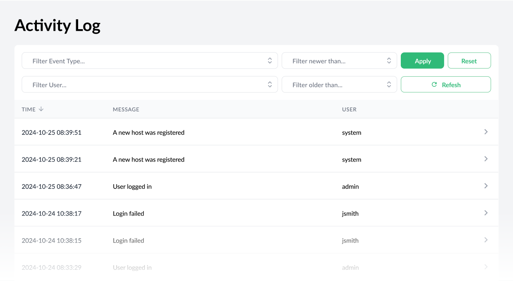
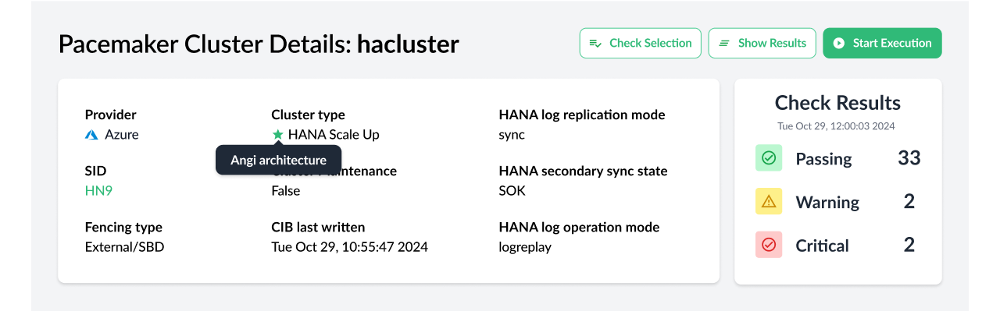
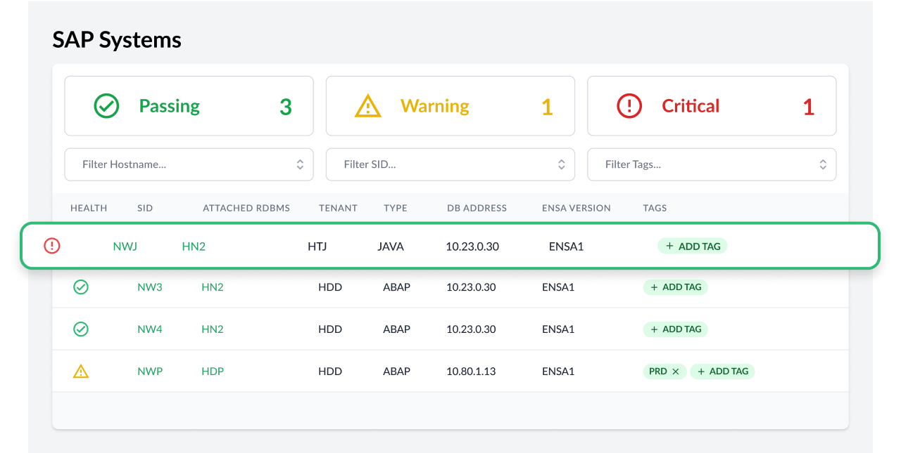
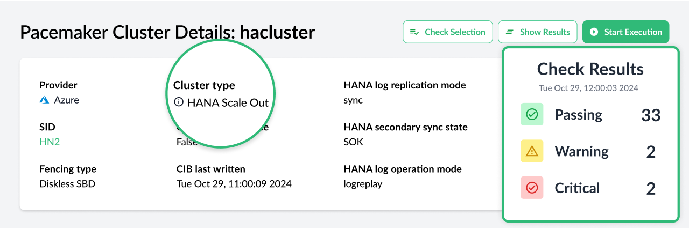

Features in the first versions of Trento have been developed around two major cornerstones: observability/monitoring and configuration checks. The latest version of Trento brings its core competences to enterprise-grade level and opens the door to future features around a third cornerstone: operation/automation.

# New Permission-based User Management System with Optional MFA
Trento 2.4 brings a local permission-based user management system that allows to segregate different roles: user managers, SAP administrators with display-only access, 
SAP administrators with configuration permissions and SAP administrators with execution permissions. Additionally, users can enable Multi Factor Authentication for increased security. 

# Single Sign-On and Third-party IDP Integration via OIDC, OAUTH2 and SAML Protocols
For centralized user management purposes, Trento can integrate with third-party identity providers using OIDC, OAUTH2 and SAML protocols. When such integration is enabled, users are provided by the identity manager server but permissions are still managed within Trento.

# Contextual, Detailed Overview of Available Patches and Upgradable Packages in the SUSE Manager Integration
Trento 2.4 deepens the integration with [SUSE Manager (SUMA)](https://www.suse.com/products/suse-manager/) by providing a overview of available patches/advisories and upgradable packages for each registered host that is also managed by SUMA. For each advisory displayed in these overviews, a details view is available with relevant information about it, such as whether it requires a reboot or no, associated vulnerabilities (CVEs), or a list of affected hosts.

# Inception of the Activity Log
An Activity Log is now available, providing a centralized location to browse past events and user actions.

# Delivery of Trento Checks Decoupled from Delivery of Core Functionality
Trento Checks have always been a integral part of the Trento Server and, particularly, the Checks Engine component known as Wanda. But starting with version 2.4 they are delivered separately. This will enable customers to update their Checks catalog with new checks or changes to existing checks as soon as they are released, without having to wait for a full new-version cycle release. This will be possible regardless the chosen deployment type for Trento Server: on K8s, systemd or containerized. 

Along with this decoupling, the Checks themselves have been relicensed from Apache 2.0 to GPL 3.0.

# Enhanced Discovery Capabilities
Trento 2.4 is able to discover Pacemaker clusters using SAPHanaSR-angi and SAP systems running on JAVA stacks.

# More Configuration Checks
Last but not least, the latest version of Trento brings new configuration checks for HANA scale-out clusters and additional configuration checks for ASCS/ERS clusters.

# Are you wanting to upgrade or try out Trento?
Follow the [instructions in our documentation](https://documentation.suse.com/sles-sap/trento/single-html/SLES-SAP-trento/index.html "Getting started with Trento Premium") to get started.
