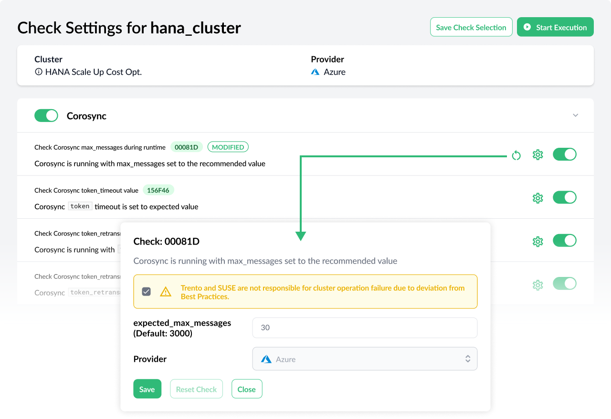

Trento 2.5 closes a first development cycle focused on observability and compliance. Stay tuned for a new major version of Trento with the first operation use cases! Coming soon.

# Discovery of Hana Scale-up Cost Optimized Clusters
With the discovery of HANA scale-up cost optimized clusters, along with the corresponding configuration checks, Trento delivers on coverage of the most important HA pacemaker-based scenarios for SAP workloads on SLES for SAP. 

# Checks Customization
The new version of Trento provides a more flexible Checks Catalog by allowing customers to customize checks in situations where there is a justified reason to depart from our Best Practices.

# Enhanced Activity Log
The activity log, which is the central point where users can review past actions and events, gets reinforced with the introduction of important enhancements such as search by metadata, auto refresh capabilities, severity information and permission-based access level.

# More Flexible Prometheus Integration
In this new version, the IP address and the port that the node exporter is listening to can be specified in the corresponding agent configuration file, hence ensuring that the communication from Prometheus server to the node exporter works fine.

# Discovery Optimization in Edge-Case Scenarios
Based on direct customer feedback, the new Trento version improves the discovery behavior in not supported or not recommended scenarios. For example, pacemaker clusters combining HANA and ASCS/ERS resources or not managed instances running on cluster nodes.

# Are you wanting to upgrade or try out Trento?
Follow the [instructions in our documentation](https://documentation.suse.com/sles-sap/trento/single-html/SLES-SAP-trento/index.html "Getting started with Trento Premium") to get started.
