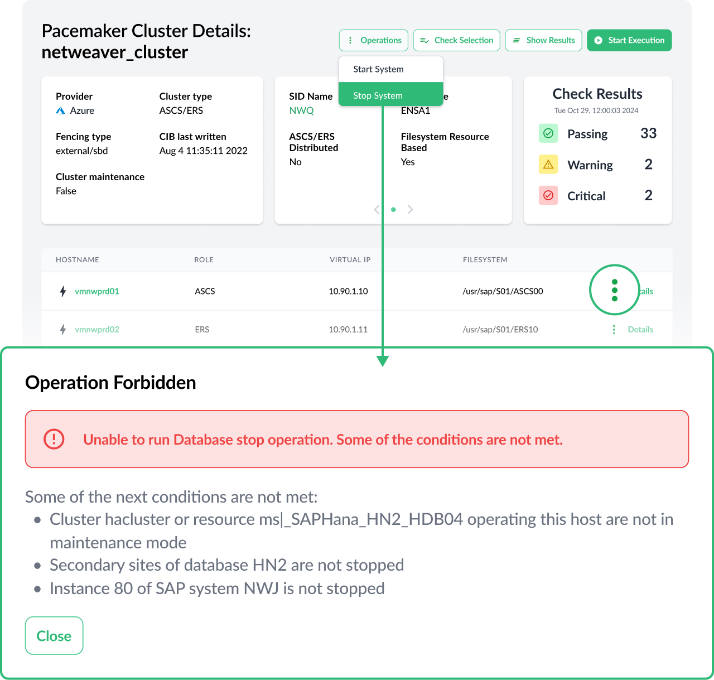
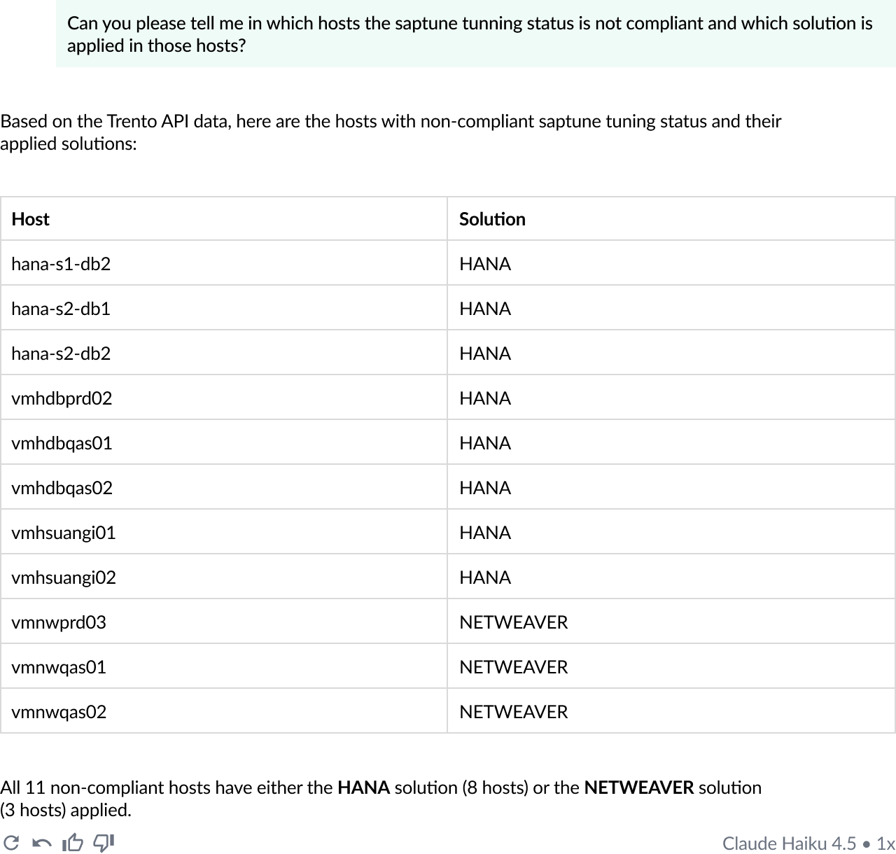
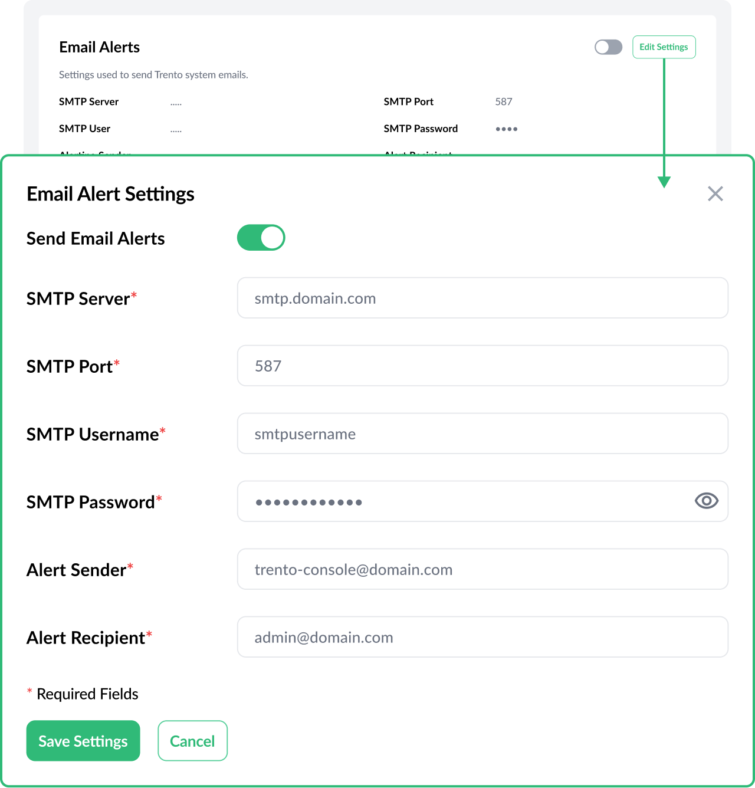
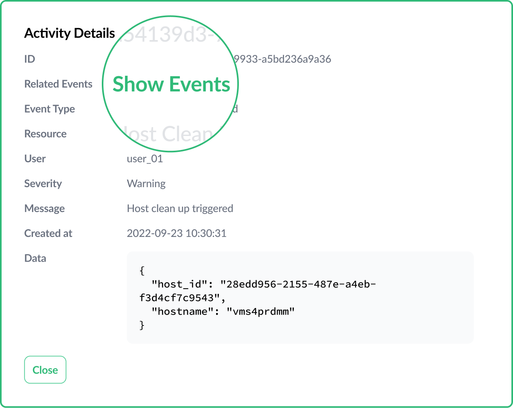
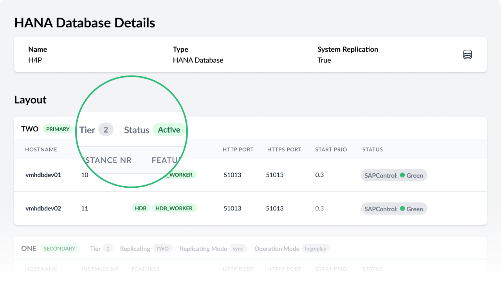

Version 3.0 marks a milestone in the development of Trento by extending the application scope to automation with a first set of operation use cases, and beginning to explore the potential of AI with MCP integration.

# First Operation Use Cases
Version 3.0 comes with a set of operations that will allow users to prepare their clusters for offline maintenance. This first set of operations includes host operations (saptune apply, saptune change, reboot), cluster operations (turn maintenance on/off, enable/disable pacemaker service at boot, node stop/start), HANA operations (stop/start database) and SAP operations (stop/start SAP instance, stop/start SAP system). Operations in Trento are ruled by four principles:

* They are protected by permissions: only users with the right permissions can perform operations.
* The path in the UI to access a particular operation is contextual and it depends on the particular target. The path is not the same, for example, to set an entire cluster in maintenance than to set a particular resource in maintenance.
* They include internal policies to prevent users from executing them when such execution violates documented, well established best practices. For example, you can not stop a database if you have running application server instances connected to it. 
* Only one operation at a time is allowed on any given target.

# Model Context Protocol (MCP) Integration
Trento 3.0 includes a new component, the Trento MCP Server, which  directly connects your enterprise LLM to the deep, real-time observability of the Trento platform, transforming your AI into an expert for your most critical SAP landscapes. It leverages Trento's powerful discovery engine to provide a live, detailed inventory of your entire SAP infrastructure—including HANA databases, application servers, and complex Pacemaker high-availability (HA) clusters. By securely exposing Trento's continuous health checks and SUSE best-practice validations via the Model Context Protocol, you empower your LLM to move beyond generic advice. Your AI can now instantly diagnose real-world misconfigurations, understand complex HA cluster statuses, and generate actionable remediation plans based on the actual, live state of your production SAP systems.

# A Stronger Core and Improved Capabilities Around Observability and Compliance
Trento 3.0 continues to strengthen the core and the capabilities around observability and compliance:

* A more flexible, secure alert emails configuration.
* A more helpful activity log with correlation of entries.
* Improved observability around offline clusters and HANA native HA scenarios (including multi target/tier setups).
* Improved configuration validation with additional scenario-specific checks.

# Are you wanting to upgrade or try out Trento?
Follow the [instructions in our documentation](https://documentation.suse.com/sles-sap/trento/single-html/SLES-SAP-trento/index.html "Getting started with Trento") to get started.
