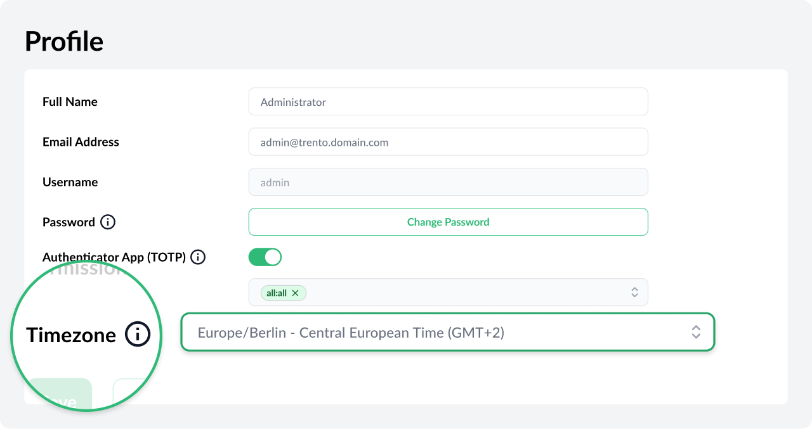
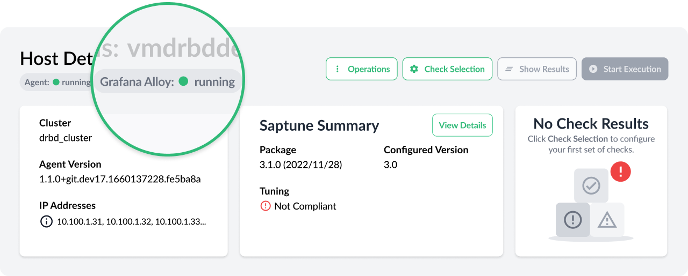
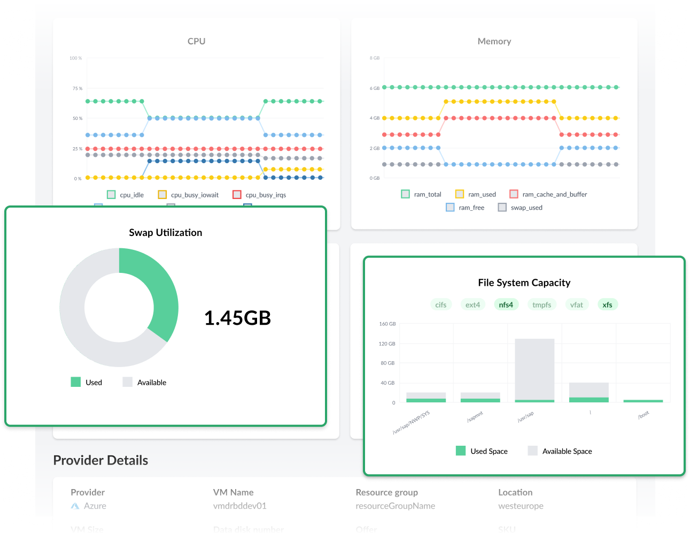
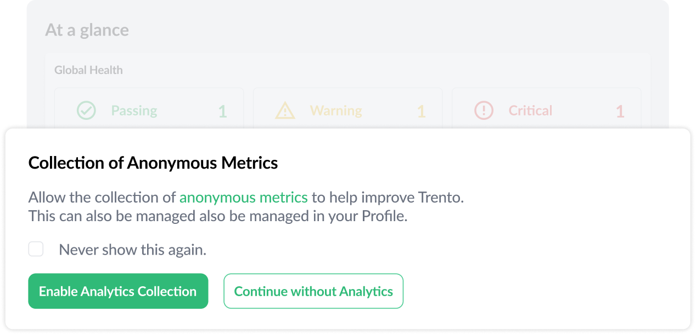

Trento 3.1 continues the road started with [Trento 3.0](../../2025/release-3.0) around automation and AI capabilities. It also strengthens the application core and brings important observability improvements.

# Timezone Awareness
Trento 3.1 allows users to select the timezone in which date and time stamps are displayed across the UI. This facilitates, for example, understanding when past events collected in the Activity Log actually happened, as the user doesn't have to convert the timestamps from UTC.

# Integration with Grafana Alloy
Grafana Alloy replaces the Prometheus Node Exporter in SUSE Linux Enterprise Server for SAP applications 16, and it's offered as an alternative to it in SUSE Linux Enterprise Server for SAP applications 15 SP7. Trento 3.1 integrates with Grafana Alloy to ensure that host metrics continue to be collected no matter which service is running in the SAP host. Prometheus Server remains as the component gathering the metrics and serving them to Trento Server. But different from hosts using the Node Exporter, it operates in push mode rather than pull mode with Grafana Alloy hosts. Inbound connectivity into the SAP environment is not required when using Grafana Alloy.

# Exposure of Metrics to MCP
Trento 3.1 strengthens its AI capabilities by exposing the host metrics collected by the Node Exporter and Grafana Alloy in the SAP hosts to the Trento MCP Server. This is the first step into enabling your AI assistant to perform root-cause analysis on issues found in your environment and it will be complemented further down the road by the consumption of relevant logs.  You can now ask questions about metrics to your AI assistant:



# Filesystem and Swap Utilization Dashboards
For each registered host, the corresponding details view now includes filesystem and swap utilization dashboards in addition to the already existing ones about CPU and memory utilization:

# Improved UX Around Operations and New Operation Use Cases
Trento 3.1 brings significant improvements in the user experience around operations:

* Visibility of the cluster state in the cluster details view.
* Detailed information about failed operations in the Activity Log.
* Better handling of operation when the heartbeat of the target host is failing.
* Links to relevant details view in operation forbidden modals.

The new version also delivers new operation use cases: cluster resource refresh and stop/start with a single request of the entire database layer in HA deployments, including multi-tier/target setups.

# Analytics
Last but not least, Trento 3.1 offers the user an option to share with SUSE, non-sensitive data on how they use the application. This optional feature, when enabled by users, will allow the Trento Team to understand better how customers use the application and to identify areas of potential improvement.

# Are you wanting to upgrade or try out Trento?
Follow the [instructions in our documentation](https://documentation.suse.com/sles-sap/trento/single-html/SLES-SAP-trento/index.html "Getting started with Trento") to get started.
