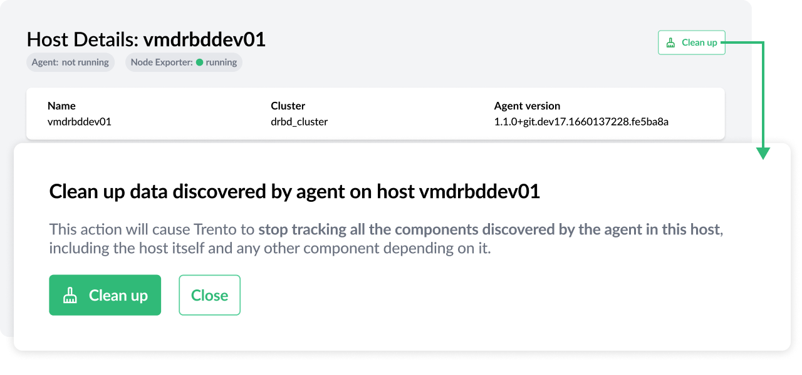

Trento 2.0.0 was a turning point in the Project as it introduced a redesigned, more secure and faster checks engine. Past this milestone, the Project refocuses on strengthening the application capabilities around configuration checks -to leverage the new checks engine-, monitoring -to improve observability- and, ultimately, automation. New versions with new user-facing features will be delivered at a faster pace and Trento 2.1.0 is just the first step in the road.

# ASCS/ERS Cluster Discovery
Trento 2.1.0 is able to discover ASCS/ERS clusters, from the simplest set-up with one SAP system and two-nodes, to clusters running multiple systems and nodes. The discovery process covers both versions of the Enqueue Server, ENSA1 and ENSA2, and, also, both scenarios where the instance filesystems are managed by the cluster and scenarios with a simple mount setup.

# More Insightful Checks Results View
Trento 2.1.0 comes with a redesigned checks results view that leverages the full potential of the new checks engine and provides the user with deeper insights about the check execution.

The current check results view is host centric. You have a section for each host in the cluster and, in each section, you see the results of the check executions in that host. If the user has selected a large number of checks, this distribution makes it hard to understand the check behaviour across the cluster.

The new checks results view gives priority to the check itself. And for any given check you are able to expand the corresponding row to get more information at host level. Additionally, for each not-met expectation, there will be a detailed view providing information about it: what facts were gathered, what values were expected and what was the result of the evaluation. This will help users understand better why a certain configuration check is failing.

# Host Clean-up Capabilities
The cleanup feature that comes with Trento 2.1.0 will enable users to soft delete from the console hosts that are no longer part of the SAP environment. Right now, once a host has been registered, you cannot take it away nor any of the resources running on it. Imagine you have completed a migration to S4HANA, and you decommission one of the source ECC systems. You no longer need to see the hosts that are part of that ECC system in the console. This feature will help you get rid of them.

The feature will become available in the console when the heartbeat of an agent has failed for a certain period of time. When that happens, an option to clean up the host will show up both in the Hosts overview and the corresponding Host details view.

When the user clicks on the cleanup button, a box will open asking for confirmation and, if the user gives it, all the components discovered by the agent in that particular host, including the host itself and other components that might depend on the ones running on the host, will be removed from the console.

# Are you wanting to upgrade or try out Trento?
Follow the [instructions in our documentation](https://documentation.suse.com/sles-sap/trento/single-html/SLES-SAP-trento/index.html "Getting started with Trento Premium") to get started.