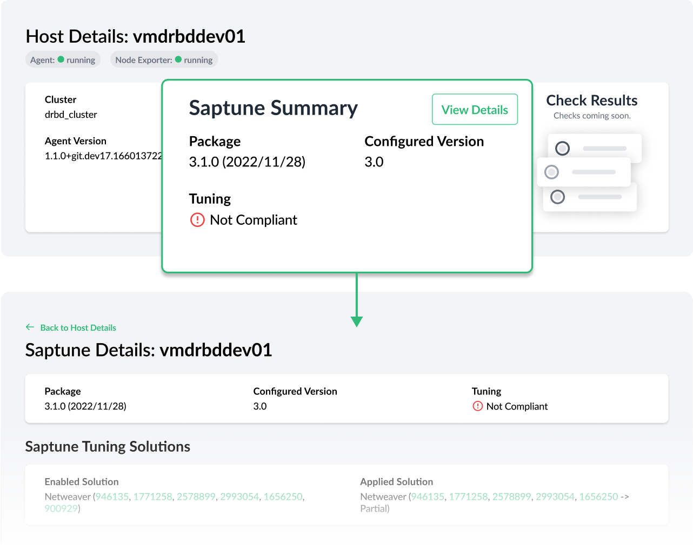
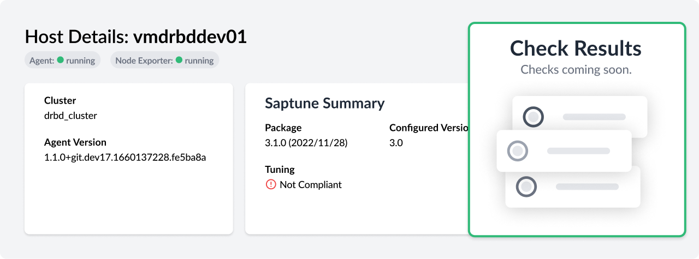

Version 2.2.0 deepens the observability capabilities of Trento with the integration of saptune in the console and kicks off the process to expand the configuration checks catalog to other HA scenarios, such as ASCS/ERS clusters, and other targets in the environment, such as hosts.

# Saptune Web Integration
Saptune is a solution that comes with SLES for SAP and allows SAP admins to ensure that their SAP hosts are properly configured to run the corresponding SAP workloads. The integration of saptune in the Trento console gives the SAP admin visibility over the tool even when they are not working at operating system level. The integration supports [saptune 3.1.0](https://www.suse.com/c/saptune-3-1-on-the-horizon "Read more about saptune 3.1.0") and higher, and includes the addition of the host tuning status in the aggregated health status of the host.

# Instance Clean-up Capabilities
[Version 2.1.0](/blog/release-2.1.0 "Read the release announcement for Trento v2.1.0") delivered host clean-up capabilities, allowing the SAP admin to remove from the console hosts that are no longer part of their SAP environment. But in certain scenarios, removing a host altogether might not be necessary and the SAP admin might need to remove, only, some of the instances discovered in that host. For example, imagine a host where two SAP systems are running but, for performance reasons one of them is migrated to another host. In that case, we just need to ensure that the migrated SAP system is no longer showing in the source host.

The new version of Trento covers this scenario and allows SAP Basis to do clean-up on an instance base. When a discovered instance is no longer found, a clean-up button shows up next to that particular instance both in the SAP systems overview and the corresponding SAP system details view allowing the SAP admin to get rid of it.

# Ability to Run Host-level Configuration Checks
The new checks engine introduced by version 2.0.0 opened the door to extend the checks catalog beyond HA clusters, to other targets in the environment such as hosts, HANA databases and SAP systems. Version 2.2.0 is a first step in that process and enables the application to perform host specific checks. Soon we will have in our catalog saptune specific checks, complementing the integration of saptune in the Trento web console, and hardening checks, ensuring that our hosts are properly configured from a security point of view.

In addition to the features listed above, version 2.2.0 comes with a full set of new gatherers that will allow us to implement new configuration checks for ASCS/ERS clusters. It also delivers a number of bug fixes, including a correction on how the application handles scenarios where two instances in the same SAP system share the same instance number.

# Are you wanting to upgrade or try out Trento?
Follow the [instructions in our documentation](https://documentation.suse.com/sles-sap/trento/single-html/SLES-SAP-trento/index.html "Getting started with Trento Premium") to get started.