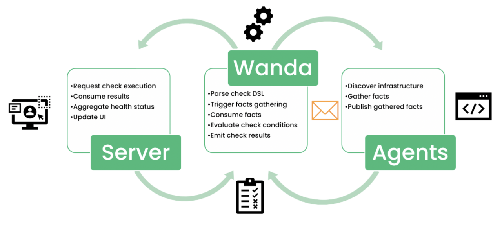
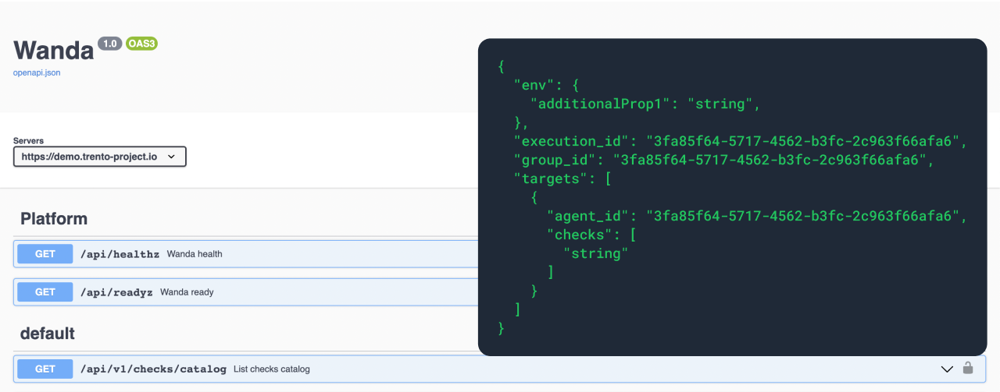

Available beginning of May’23, Trento 2.0.0 brings major changes to the architecture of the solution and therefore it will be **necessary an update on both the server** and the agents for those customers that are already using Trento. 

The main change in the new version is a brand-new SSH-less checks engine, but it also adds VMware to the list of known platforms and provides versioned external APIs for both the web and engine components.



# SSH-less Checks Engine

The old engine required an SSH connection from the server to the cluster nodes to execute the checks, which were nothing but Ansible playbooks. With the new checks engine the SSH connection is no longer necessary, which **helps improve the security** of the entire architect. Moving forward there will be only one secured communication channel from the agent host to the server and there will be no need to maintain an SSH key specific for Trento nor an SSH user with elevated access to execute the Ansible playbooks.

In the new checks engine, that we internally call wanda, the execution of a check is split in two stages. On one side, the agent is responsible for gathering the required data, we call them facts. The facts are sent by the agent to the checks engine which in turn performs their evaluation. This division of responsibilities translates in a reduced footprint on the SAP host and a much better performance.

The new checks engine comes with a new Domain Specific Language where checks are represented by yaml files with a human readable structure.

```yaml
## Check YAML (Domain Specific Language) Example
id: "156F64"
name: Check Corosync token_timeout value
group: Corosync
description: |
  Corosync `token` timeout is set to expected value
remediation: |
  ## Abstract
  The value of the Corosync `token` timeout is not set as recommended.

  ## Remediation
  Adjust the corosync `token` timeout as recommended on the best practices, and reload the corosync configuration...

  ## References...

facts:
  - name: corosync_token_timeout
    gatherer: corosync.conf
    argument: totem.token

values:
  - name: expected_token_timeout
    default: 5000
    conditions:
      - value: 30000
        when: env.provider == "azure" || env.provider == "aws"
      - value: 20000
        when: env.provider == "gcp"

expectations:
  - name: token_timeout
    expect: facts.corosync_token_timeout == values.expected_token_timeout
```

**The new checks engine is the gateway to the following features:**
* Configuration checks for other HA scenarios (ASCS/ERS, Cost Optimized, Scale-Out).
* Configuration checks for other targets (hosts, HANA databases and NetWeaver instances).
* Checks customization overriding values from best practices with custom values proven to work better in the customer particular setup.
* Addition of custom checks by customers and partners to cover areas of the SAP environment beyond Trento scope.

# VMware Discovery & Versioned APIs

Trento 2.0.0 adds VMware to the list of known platforms, along with Azure, AWS, GCP and on-premise bare metal. With this addition, most customers running SAP systems on SUSE Linux Enterprise Server for SAP are represented in Trento.


Last but not least, both the web and the engine components are now available with a set of versioned public APIs which ultimate goal is to facilitate the integration of Trento with other monitoring tools. With these APIs you can essentially retrieve any information currently displayed in the console, like a list of the registered SAP systems or the status of the node exporter in any given host, and perform any available actions, like selecting and executing checks or setting and removing tags.

For a full list of available, versioned external APIs go to:
* https://www.trento-project.io/web/swaggerui/
* https://www.trento-project.io/wanda/swaggerui/



# Are you wanting to upgrade or try out Trento?
Follow the [instructions in our documentation](https://documentation.suse.com/sles-sap/trento/single-html/SLES-SAP-trento/index.html "Getting started with Trento Premium") to get started.
